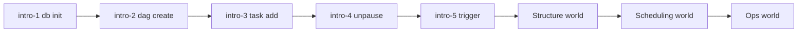

# LearnAirflow

An interactive **Apache Airflow** visualizer, sandbox, and tutorial for workflow orchestration.

**Live:** https://alisadeghiaghili.github.io/learn-airflow/

Airflow turns scheduled data work into **DAGs** — tasks, dependencies, schedules, retries, and run history. LearnAirflow makes that surface visible: **DAG folder → Graph → Runs**, with guided levels that teach the mental model, not just the commands.

## Curriculum

| World | ID prefix | What you learn |
|-------|-----------|----------------|
| Introduction | `intro-` | architecture, DAG, operator, logical date / data interval, trigger, `dag.test()` |
| Structure | `struct-` | edges, `upstream_failed`, clear/recover, **trigger rules**, branching |
| Data & TaskFlow | `data-` | XCom, `@task`, templates (`{{ ds }}`), dynamic task mapping |
| Scheduling | `sched-` | cron/presets, `max_active_runs`, catchup/backfill, datasets |
| Ops | `ops-` | retries, pools/SLA/alerts, Variables/Connections, executor, logs, capstone ETL |

Start at **`intro-1`**. Each level has:

- intro dialogs (what happens and why)
- **Goal board** target state
- live goal checks + solution commands + par (command golf)
- `hint` / `show goal` / `show solution` / `undo` / `reset`
- celebration + share (LinkedIn / X / Facebook) with your learned curriculum
- progress saved in `localStorage` + cookie (resume next week)



## Features

- Sandbox with seeded DAGs
- Terminal: history (↑/↓), word-by-word Tab completion, command golf
- Goal panel with neon current step + solution checklist
- Post-command “Why” teaching blocks
- Share cards after each solve (progress-aware copy)

## Quick start

```bash
npm install
npm run dev
npm test
npm run build
```

GitHub Pages deploys from `main` via `.github/workflows/deploy-pages.yml`.

## Useful commands inside the app

```
help
levels
hint
airflow db init
dag create hello_airflow --schedule "@daily"
task add hello_airflow print_date --op PythonOperator
airflow dags unpause hello_airflow
airflow dags trigger hello_airflow
dep etl_daily extract >> transform >> load
airflow tasks clear etl_daily -t extract -y
dag update report_daily --schedule "@daily" --catchup
airflow dags backfill report_daily -s 2024-05-28 -e 2024-05-30
airflow variables set batch_size 250
airflow connections add postgres_warehouse --conn-uri postgres://wh:5432/analytics
task update flaky_pipeline notify --retries 2
```

Share links: open with `?NODEMO` to skip the intro dialog.

## Project layout

```
src/engine/   # orchestration simulation, CLI interpreter, goal compare, teaching notes
src/levels/   # worlds + level definitions
src/ui/       # board, terminal, dialogs, celebrate/share
tests/        # vitest — every official solution must solve its goal
```

## Notes

- Teaching simulator, not a real Airflow deployment. The scheduler processes runs immediately after `trigger`/`clear`.
- Real docs: [airflow.apache.org/docs](https://airflow.apache.org/docs/)

## License

Apache License 2.0. See [LICENSE](LICENSE) and [NOTICE](NOTICE).

Independent teaching simulator. Not affiliated with the Apache Software Foundation.
