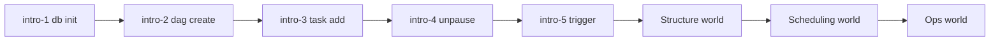

# LearnAirflow

An interactive **Apache Airflow** visualizer, sandbox, and tutorial — the **learnGitBranching teaching model** applied to workflow orchestration.

**Live:** https://alisadeghiaghili.github.io/learn-airflow/

LGB teaches git by making the commit tree visible and walking you through worlds of levels. LearnAirflow does the same for Airflow: the board shows **DAG folder → Graph → Runs**, and each level installs one idea.

## Curriculum (LGB-style worlds)

| World | ID prefix | What you learn |
|-------|-----------|----------------|
| Introduction | `intro-` | `db init` → author DAG → add task → unpause → trigger → run history |
| Structure | `struct-` | tasks, `>>` edges, `upstream_failed`, `tasks clear` recovery |
| Scheduling | `sched-` | schedule, catchup, backfill, pause |
| Ops | `ops-` | variables, connections, retries, full recovery drill |

Start at **`intro-1`**. Each level has:

- intro dialogs (mental model first)
- **Goal board** text (LGB goal-tree equivalent)
- live goal checks + solution commands + par (command golf)
- `hint` / `show goal` / `show solution` / `undo` / `reset`



## Features

- Sandbox with seeded DAGs
- Terminal simulating core `airflow` CLI + authoring helpers
- Goal panel with solution checklist + goal visual
- Command golf + progress in `localStorage`
- Share cards after each solve

## Quick start

```bash
npm install
npm run dev
npm test
npm run build
```

GitHub Pages deploys from `main` via `.github/workflows/deploy-pages.yml`.

## Useful commands inside the app

```
help
levels
hint
airflow db init
dag create hello_airflow --schedule "@daily"
task add hello_airflow print_date --op PythonOperator
airflow dags unpause hello_airflow
airflow dags trigger hello_airflow
dep etl_daily extract >> transform >> load
airflow tasks clear etl_daily -t extract -y
dag update report_daily --schedule "@daily" --catchup
airflow dags backfill report_daily -s 2024-05-28 -e 2024-05-30
airflow variables set batch_size 250
airflow connections add postgres_warehouse --conn-uri postgres://wh:5432/analytics
task update flaky_pipeline notify --retries 2
```

Share links: open with `?NODEMO` to skip the intro dialog.

## Project layout

```
src/engine/   # orchestration simulation, CLI interpreter, goal compare
src/levels/   # LGB-style worlds + level definitions
src/ui/       # board, terminal, dialogs, app shell
tests/        # vitest — every official solution must solve its goal
```

## Notes

- Teaching simulator, not a real Airflow deployment. The scheduler processes runs immediately after `trigger`/`clear`.
- Real docs: [airflow.apache.org/docs](https://airflow.apache.org/docs/)
- Product shape inspired by [learnGitBranching](https://github.com/pcottle/learnGitBranching)

## License

Apache License 2.0. See [LICENSE](LICENSE) and [NOTICE](NOTICE).

Independent teaching simulator. Not affiliated with the Apache Software Foundation or pcottle/learnGitBranching.
